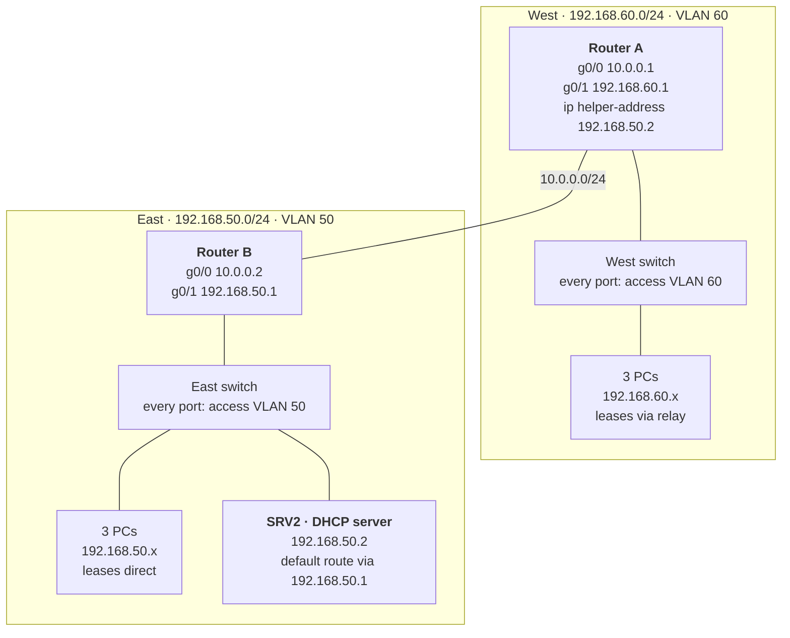

# Two-Network DHCP Relay Lab (Cisco IOS)

One DHCP server hands out IP addresses to two separate networks connected by two routers. The server serves its own network directly, and the far router forwards the other network's DHCP requests to it with `ip helper-address` (DHCP relay). Built in SwitchLab.



## What this lab covers

- Two LANs, each its own subnet and VLAN, joined only by routers
- Static routing between the routers
- A central DHCP server leasing addresses to a remote network through a relay
- Troubleshooting with `show` commands, hop by hop

## IP plan

| Device | Port | Address | Role |
| --- | --- | --- | --- |
| Router A (west) | g0/0 | 10.0.0.1/24 | Link to Router B |
| Router A (west) | g0/1 | 192.168.60.1/24 | West gateway, relays DHCP to SRV2 |
| Router B (east) | g0/0 | 10.0.0.2/24 | Link to Router A |
| Router B (east) | g0/1 | 192.168.50.1/24 | East gateway |
| SRV2 | g0/0 | 192.168.50.2/24 | DHCP server |
| East PCs | — | 192.168.50.21–254 | Leases direct from SRV2 |
| West PCs | — | 192.168.60.21–254 | Leases from SRV2 via relay |

East switch ports are access ports in VLAN 50. West switch ports are access ports in VLAN 60. There is no cable between the switches, so no trunks are needed.

## How a west PC gets an address

1. The PC broadcasts a DHCP request.
2. Router A's g0/1 receives it and, because of `ip helper-address 192.168.50.2`, forwards it to SRV2 as a normal routed packet.
3. SRV2 sees the request came through 192.168.60.1 and answers from its 192.168.60.0 pool.
4. The reply returns through Router B and Router A to the PC.

This only works with a route on each router to the other network, and a default route on SRV2.

## Configs

| File | Device |
| --- | --- |
| [configs/router-a.txt](configs/router-a.txt) | Router A (west) |
| [configs/router-b.txt](configs/router-b.txt) | Router B (east) |
| [configs/srv2.txt](configs/srv2.txt) | SRV2, the DHCP server |
| [configs/switches.txt](configs/switches.txt) | East and west switches |

## Verification

Router A, `show ip route`:

```
C   10.0.0.0/24 is directly connected, g0/0
C   192.168.60.0/24 is directly connected, g0/1
S   192.168.50.0/24 [1/0] via 10.0.0.2
```

Router B, `show ip route`:

```
C   10.0.0.0/24 is directly connected, g0/0
C   192.168.50.0/24 is directly connected, g0/1
S   192.168.60.0/24 [1/0] via 10.0.0.1
```

Tests, in order:

1. Router A: `ping 10.0.0.2` (link between routers)
2. Router B: `ping 192.168.50.2` (SRV2 on its own network)
3. Router A: `ping 192.168.50.2` (routes both ways, and SRV2 can reply)
4. West PC: `ipconfig /renew`, then `ipconfig /all` shows 192.168.60.x and DHCP Server 192.168.50.2
5. SRV2: `show ip dhcp binding` lists PCs from both networks

## Troubleshooting log

The problems hit while building this, in order.

| # | Symptom | Cause | Fix |
| --- | --- | --- | --- |
| 1 | `ipconfig /release` failed: no adapter in a permissible state | PC had a static IP, DHCP off | `netsh interface ipv4 set address name="eth0" source=dhcp` |
| 2 | Tried an IPv6 `netsh` command | Wrong tool: IPv6 router discovery, not IPv4 DHCP | Used the IPv4 command above |
| 3 | Router ports "administratively down", CDP showed 0 neighbors | Router ports start shut down | `no shutdown` |
| 4 | Router g0/1 set to 192.168.5.1 | Typo | Corrected the address |
| 5 | Lab flagged MISSING_TRUNK, so I configured a trunk | Wrong tool: no switch-to-switch cable exists, and VLANs don't cross routers | Set the port back to access |
| 6 | `ping ... source g0/1` failed on a switch | Switch ports are Layer 2 and have no IP | Ping from a router |
| 7 | Router couldn't reach SRV2 | Static route typo: `92.168.50.0` instead of `192.168.50.0` | Deleted it with `no ip route ...`, added the correct route |
| 8 | DHCP server "not reachable in VLAN 50" | VLAN 50 on each side is a separate network; routers stop DHCP broadcasts | DHCP relay on the far router |
| 9 | The router next to SRV2 had the other network's address on g0/1 | LAN addresses on the wrong routers | Router B g0/1 = 192.168.50.1, Router A g0/1 = 192.168.60.1 |
| 10 | Router A had a route `via 10.0.0.1` | Leftover route pointing at Router A's own address after re-addressing | Deleted it, added `ip route 192.168.50.0 255.255.255.0 10.0.0.2` |
| 11 | SRV2's switch port was in VLAN 1 | Never moved into VLAN 50 | `switchport access vlan 50` |
| 12 | Router A still couldn't ping SRV2, even with `ip default-gateway` set | SRV2 runs Cisco IOS and routes, so it ignores `ip default-gateway` | `ip route 0.0.0.0 0.0.0.0 192.168.50.1` on SRV2. **Final fix** |

## Lessons

1. **Trunks are for switch-to-switch links.** VLAN tags never cross a router, so a trunk can't connect two routed networks.
2. **An `ip route` next hop is the neighbor's address, never your own.** Check `show ip interface brief` first: every address listed there is yours.
3. **Some commands replace, others stack.** A new `ip address` replaces the old one. A new `ip route` is added beside the old ones, so stale routes must be deleted with `no`.
4. **Cisco IOS ignores `ip default-gateway` on a device that routes.** Give it a default route: `ip route 0.0.0.0 0.0.0.0 <gateway>`.
5. **Test hop by hop.** The first test that fails shows where the problem is.

## Next

- Replace the static routes with OSPF, then add a third router and network
- Add a second VLAN on one side with router-on-a-stick
- Add wireless and an access list to keep a guest network away from the server
